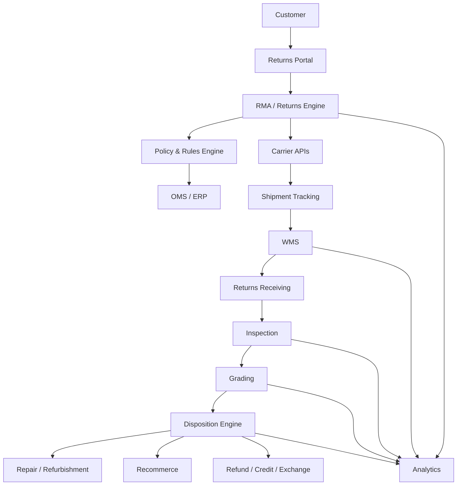
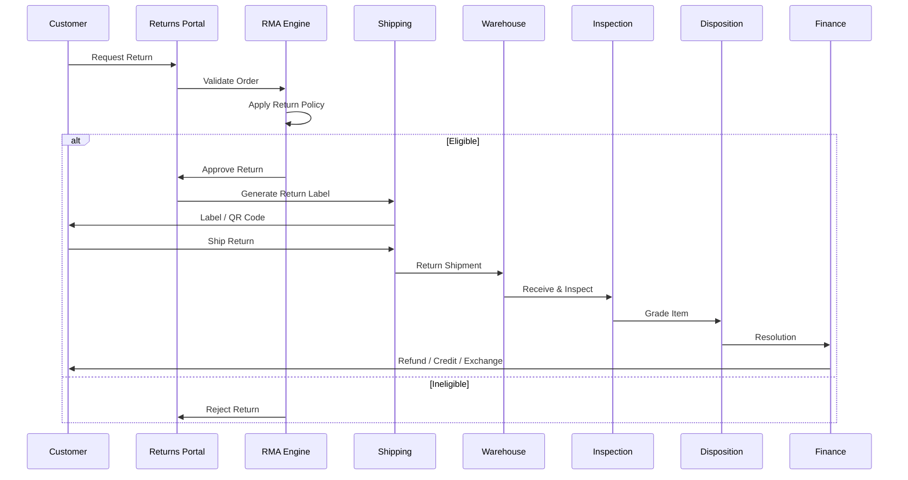
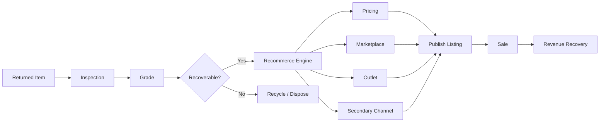
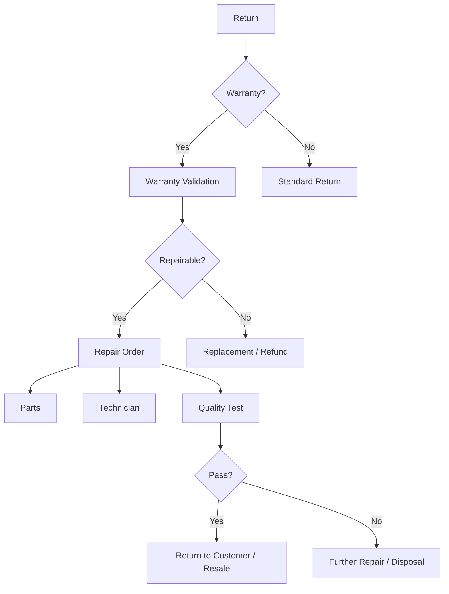
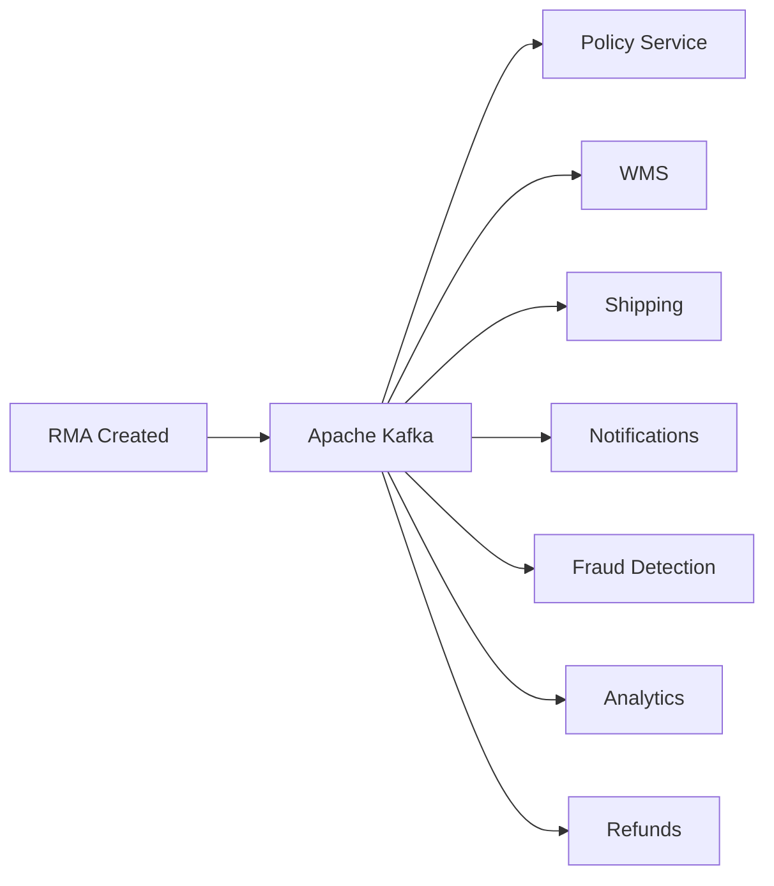
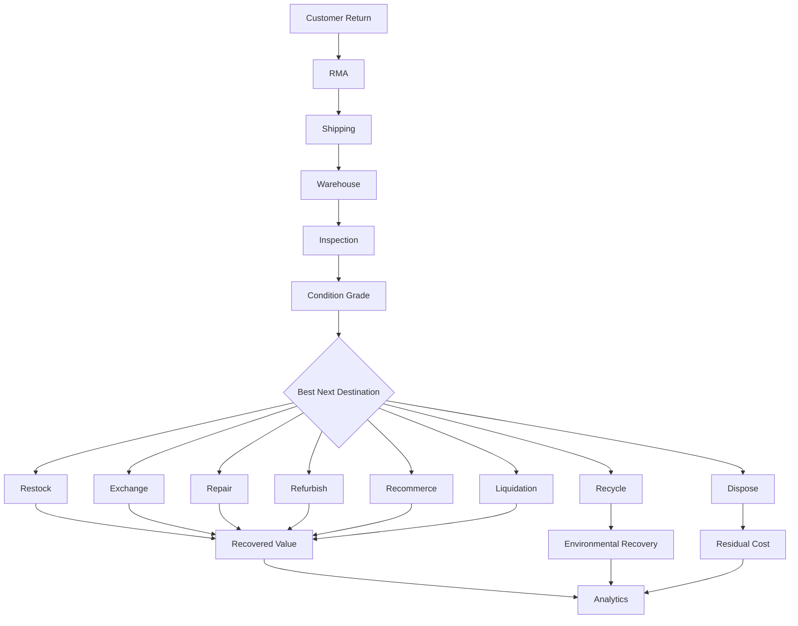
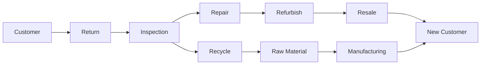
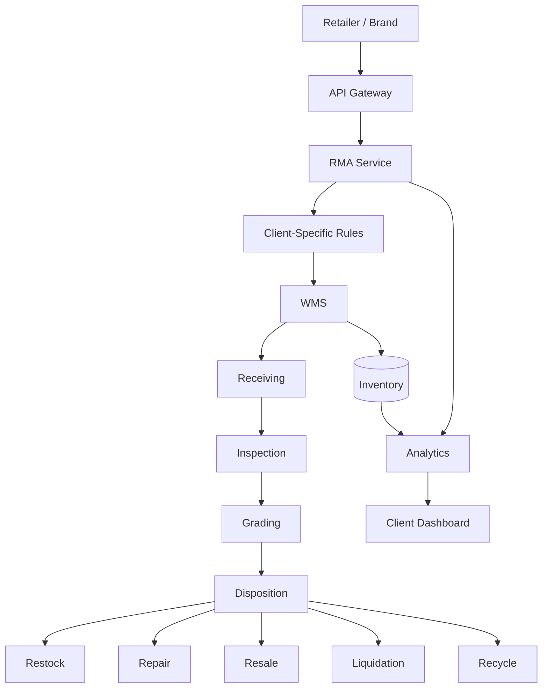
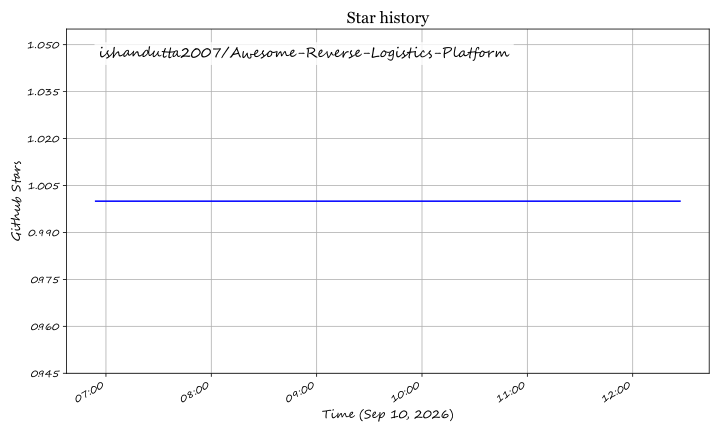

# Awesome-Reverse-Logistics-Platform

## Top Reverse Logistics Platform

**Curated List of SaaS / Hosted Platforms & Open-Source GitHub Projects**
*Focused on Returns Management, Reverse Logistics, RMA, Returns Processing, Recommerce & Recovery*
**Last updated: September 2026**

This repository tracks notable **SaaS/hosted platforms** and **open-source projects** for **Reverse Logistics and Returns Management**.

These systems manage the movement of products from customers, retailers, distributors, service centers, or other downstream locations back into the supply chain. Modern platforms cover the complete return lifecycle — from **return initiation and RMA authorization** through **shipping, receiving, inspection, grading, repair, refurbishment, restocking, resale, recycling, disposition, refunds and analytics**.

**Examples** include ReverseLogix, Optoro, Happy Returns, Loop Returns, ReturnLogic, ReturnGO, Rich Returns, Inmar Intelligence, GoTRG, and Flexe Returns.

**Open-source emphasis:** This section is heavily expanded with open-source ERP, WMS, RMA, e-commerce, inventory, repair, workflow, shipping, analytics, and warehouse projects that can be combined to build self-hosted reverse-logistics platforms.

> **Important:** There is currently no single mature open-source project that is a complete drop-in replacement for enterprise platforms such as ReverseLogix or Optoro. The strongest open-source approach is a **composable reverse-logistics stack** built from RMA + ERP/OMS + WMS + inventory + shipping + workflow + analytics components.

---

## Table of Contents

* [SaaS/Hosted Platforms](#saashosted-platforms)
* [Open-Source](#open-source)
* [Open-Source RMA & Returns Projects](#open-source-rma--returns-projects)
* [Open-Source ERP/OMS Platforms](#open-source-erproms-platforms)
* [Open-Source WMS & Warehouse Platforms](#open-source-wms--warehouse-platforms)
* [Open-Source E-Commerce Platforms with Returns](#open-source-e-commerce-platforms-with-returns)
* [Open-Source Repair & Refurbishment](#open-source-repair--refurbishment)
* [Open-Source Logistics & Shipping](#open-source-logistics--shipping)
* [Open-Source Workflow & Automation](#open-source-workflow--automation)
* [Open-Source Analytics & Reverse Logistics Intelligence](#open-source-analytics--reverse-logistics-intelligence)
* [Open-Source AI & Computer Vision](#open-source-ai--computer-vision)
* [Open-Source Data & Infrastructure](#open-source-data--infrastructure)
* [Commercial → Open-Source Mapping](#commercial--open-source-mapping)
* [Reverse Logistics Lifecycle](#reverse-logistics-lifecycle)
* [Reference Architecture](#reference-architecture)
* [Returns Management Architecture](#returns-management-architecture)
* [RMA Workflow](#rma-workflow)
* [Warehouse Returns Processing](#warehouse-returns-processing)
* [Inspection & Grading](#inspection--grading)
* [Disposition Decision Engine](#disposition-decision-engine)
* [Recommerce Architecture](#recommerce-architecture)
* [Repair & Warranty Architecture](#repair--warranty-architecture)
* [Multi-Location Architecture](#multi-location-architecture)
* [Event-Driven Architecture](#event-driven-architecture)
* [Recommended Open-Source Stacks](#recommended-open-source-stacks)
* [Capability Matrix](#capability-matrix)
* [What Open Source Can Replace](#what-open-source-can-replace)
* [What Open Source Cannot Replace Automatically](#what-open-source-cannot-replace-automatically)
* [Best Open-Source Projects](#best-open-source-projects)
* [Top Open-Source Shortlist](#top-open-source-shortlist)
* [How to Contribute](#how-to-contribute)
* [Disclaimer](#disclaimer)

---

## SaaS/Hosted Platforms

The following commercial SaaS and hosted reverse-logistics platforms provide returns management systems (RMS), customer return portals, box-free drop-off networks, warehouse inspection/grading, repair management, and recommerce/liquidation workflows.

| Platform | Focus & Key Capabilities | Starting Pricing | Free Tier / Free Trial Limits |
| :--- | :--- | :--- | :--- |
| **[ReverseLogix](https://www.reverselogix.com/)** | Enterprise Returns Management System (RMS) covering end-to-end customer return portals, RMA orchestration, warehouse inspection, grading, repairs, warranty management, and disposition rules engine. | **~$1,500/month** (~$18,000/year base enterprise platform subscription; includes core RMA portal and warehouse returns processing modules) | **30-day enterprise evaluation pilot**: includes dedicated RMS staging sandbox, up to 2 customized return policy workflows, and testing for up to 250 simulated returns with ERP/WMS integration validation. |
| **[Optoro](https://www.optoro.com/)** | Enterprise returns-management and reverse-logistics platform optimizing returns receiving, automated AI grading, smart routing, restock, and secondary-market recommerce resale. | **~$2,500/month** (~$30,000/year base enterprise platform subscription for returns processing and routing engine; plus 10%–15% recommerce recovery fee on resold secondary inventory) | **30-day guided Proof of Concept (POC) pilot**: includes sandbox access to Optoro returns routing engine, historical return SKU data audit, and simulation of up to 500 return dispositions for qualified enterprise retailers. |
| **[Happy Returns](https://happyreturns.com/)** *(UPS)* | In-person, box-free, label-free returns network across 10,000+ Return Bar locations, consolidated reverse logistics, and merchant return management portal. | **$350/month** (Base SaaS platform fee for merchant portal and label generation, plus ~$5.50 per Return Bar drop-off transaction) | **30-day pilot trial**: includes access to merchant returns portal, QR-code return initiation, and up to 50 trial Return Bar drop-off transactions during onboarding. |
| **[Loop Returns](https://www.loopreturns.com/)** | Leading Shopify-centric returns and exchanges platform featuring "Shop Now" instant exchanges, bonus credit incentives, carrier routing, and automated fraud prevention. | **$0/month** (Checkout+ free-to-use shopper-funded plan; Essential plan starts at **$155/month** for up to 1,000 returns/year) | **Free Forever Plan (Checkout+)**: unlimited returns under shopper-funded model, branded returns portal, domestic return labels, and Return Bar network drop-offs; paid plans include **14-day free trial** with full feature access for up to 50 return authorizations. |
| **[ReturnLogic](https://www.returnlogic.com/)** | Returns and RMA management software for eCommerce brands, automating customer return portals, warranty tracking, warehouse inspection, and exchange workflows. | **$299/month** (Base subscription tier on 12-month agreement; or per-return pricing starting at $3.90/return tapering to $0.25/return based on volume) | **14-day guided sandbox trial**: full access to RMA rules engine, self-service return portal customization, and up to 25 test return and exchange workflows with mock customer accounts upon sales consultation. |
| **[ReturnGO](https://returngo.ai/)** | AI-driven post-purchase and returns management platform delivering automated product exchanges, store credit incentives, return-to-store, and sustainability tracking. | **$147/month** (Premium tier; Pro tier starts at $297/month for advanced automation and API/webhook access) | **14-day free trial**: full access to chosen plan features (Premium or Pro), includes self-service portal setup and up to 50 processed returns during the trial period without upfront annual commitment. |
| **[Rich Returns](https://www.richreturns.io/)** | Self-service returns and exchanges platform engineered for Shopify merchants, providing automated prepaid return labels, customer notifications, and custom return policies. | **$19/month** (Standard plan; includes 10 returns/month, $1.00/additional return; Pro tier at $39/month for 50 returns/month) | **14-day free trial**: full access to branded return portal, automated label generation, and custom return reasons, capped at 10 returns during the trial period. |
| **[Inmar Intelligence](https://www.inmar.com/)** | Enterprise reverse logistics, returns processing, liquidation, recommerce, and supply chain asset recovery services with high-volume nationwide distribution centers. | **~$2,500/month** (~$30,000/year base enterprise platform subscription for returns management software; or $1.25–$2.50 per unit processed in Inmar facilities) | **30-day proof of value (POV) pilot**: includes historical reverse-logistics audit, simulation of disposition routing algorithms, and testing of up to 200 return units through Inmar’s returns portal. |
| **[GoTRG (ReturnPro)](https://www.gotrg.com/)** | End-to-end reverse-logistics and recommerce platform covering omnichannel returns processing, AI grading, refurbishing, and liquidation to secondary marketplaces. | **$0/month** (Base platform connector for marketplace sellers; enterprise managed reverse logistics starts at **~$1,500/month** plus 10%–20% liquidation recovery fee) | **Free Forever Plan (Connector Tier)**: up to 1,000 returns/month for connected Shopify and Walmart seller accounts, 1 user seat; enterprise tiers include **30-day sandbox pilot** with up to 100 test item gradings. |
| **[Flexe](https://www.flexe.com/)** | On-demand logistics and warehousing platform offering flexible reverse logistics, warehouse returns intake, inspection, refurbishment, and inventory restock across nationwide 3PL facilities. | **~$2,000/month** (~$24,000/year base network software and capacity reservation commitment; plus per-pallet monthly storage and $2.00–$3.50/unit inbound returns handling) | **30-day supply chain assessment pilot**: includes reverse-logistics network modeling, warehouse integration feasibility sandbox, and test receiving workflow configuration for up to 50 sample return shipments. |
| **[Narvar](https://corp.narvar.com/)** | Enterprise post-purchase customer experience, delivery tracking, and returns management platform supporting boxless drop-offs at 200,000+ retail locations. | **~$2,500/month** (~$30,000/year base enterprise contract; scaling based on order and return volume) | **30-day enterprise sandbox evaluation**: full access to branded tracking and returns portal configuration, carrier API webhooks, and up to 500 test return label generations for qualified mid-market and enterprise retailers. |
| **[AfterShip Returns](https://www.aftership.com/returns)** | Global returns and exchanges automation platform featuring self-service customer portals, instant exchanges, automated return labels, and multi-carrier tracking. | **$19/month** (Essentials plan; includes 20 returns/month, $0.50 per additional return; Pro tier at $99/month for 100 returns/month) | **Free Forever Plan**: includes up to 3 returns/month with branded returns portal and basic email notifications; **7-day free trial** of Essentials and Pro plans with up to 50 trial return labels and advanced exchange features. |
| **[Return Rabbit](https://returnrabbit.com/)** *(Shipfusion)* | Automated returns and exchanges software designed for fast-growing eCommerce brands with smart incentives, store credit boosts, and 3PL WMS integrations. | **$250/month** (Starter tier; includes up to 200 returns/month; Pro tier starts at $500/month for up to 500 returns/month) | **14-day free trial**: access to full returns portal setup, automated exchange workflows, and up to 50 test returns during the evaluation period. |
| **[ZigZag Global](https://www.zigzag.global/)** | Global returns-management platform connecting retailers to 1,500+ carrier services, 130+ countries, and 450,000+ drop-off points with customs clearance and local reverse consolidation. | **£20/month** (~$26/month Silver tier; includes 20 returns/month; Gold tier is £50/month (~$65/month) for 100 returns/month) | **Free Forever Plan**: includes up to 5 returns/month with self-service return portal and QR code generation; **14-day free trial** on Silver and Gold tiers with up to 50 international return label creations. |
| **[ReBOUND Returns](https://www.reboundreturns.com/)** *(Reconomy)* | Omnichannel global reverse logistics and returns management system managing physical returns, cross-border consolidation, duty drawbacks, and environmental reporting. | **£250/month** (~$325/month base software platform fee; plus ~£1.50–£3.50 per return transaction depending on carrier routing and destination country) | **30-day pilot program**: includes live portal setup for one market, carrier label testing, and up to 100 live customer returns processed through local return drop-offs. |
| **[Sorted Returns](https://sorted.com/)** | Delivery and returns management SaaS providing branded customer returns initiation, carrier rate selection, tracking notifications, and warehouse returns receipt visibility. | **£500/month** (~$650/month base platform fee for unified tracking and returns management; annual contract) | **14-day interactive sandbox trial**: access to Sorted returns orchestration dashboard, carrier API simulator, and up to 100 test return label generations upon sales consultation. |
| **[Sendcloud](https://www.sendcloud.com/)** | European shipping and returns automation platform connecting 100+ carriers, offering customer-facing branded return portals, paid returns via Mollie, and automated customs documentation. | **€0/month** (Free plan; Lite tier starts at **€35/month** (~$38/month), Growth tier at €109/month (~$119/month)) | **Free Forever Plan**: includes up to 50 shipments/month, basic return portal, Sendcloud carrier rates, and email tracking; **14-day free trial** on Lite and Growth tiers with custom carrier contracts and automated return rule builder. |
| **[Metapack](https://www.metapack.com/)** | Enterprise delivery and returns management platform serving international omnichannel retailers with access to 400+ carriers and 350,000+ PUDO / drop-off points globally. | **~$1,500/month** (~$18,000/year base enterprise platform subscription; scaling by parcel and return consignment volume) | **30-day guided enterprise Proof of Concept (POC)**: includes carrier routing configuration, branded returns portal prototype, and test label generation for up to 300 test shipments. |
| **[Returnless](https://www.returnless.com/)** | Returns management and return prevention platform providing automated return forms, photo upload inspection, instant refunds, voucher incentives, and carrier label generation. | **€105/month** (~$115/month base Grow plan; includes up to 100 returns/month; Scale plan at €260/month for 350 returns) | **14-day free trial**: full test mode access to all platform features, return forms, and carrier label integrations (test mode only; live returns require subscription activation, no credit card required). |
| **[Revers.io](https://www.revers.io/)** | Enterprise reverse-logistics and after-sales platform managing customer returns, technician repairs, supplier warranties, and retailer RMA workflows across European retail. | **€1,000/month** (~$1,100/month; ~$12,000/year base enterprise software subscription) | **14-day staging sandbox trial**: access to RMA portal builder, repair tracking dashboard, and test return authorization workflow for up to 50 simulated customer returns upon sales qualification. |
| **[ParcelLab](https://parcellab.com/)** | Post-purchase experience and returns management engine offering branded tracking, digital returns initiation, and proactive customer communication for global brands. | **~$2,400/month** (~$28,800/year base enterprise contract covering tracking and returns Retain modules) | **30-day enterprise sandbox evaluation**: full access to branded returns portal setup, customer notification triggers, and up to 500 test transaction simulations for qualified enterprise accounts. |
| **[Shopify Returns](https://www.shopify.com/)** | Built-in native returns and exchange management for Shopify merchants, supporting customer self-service returns, label generation via Shopify Shipping, and exchange orders. | **$39/month** (Basic Shopify plan; $29/mo billed annually; includes native returns portal, automated return rules, and discounted carrier labels) | **3-day free trial** with full store and returns portal capabilities, followed by **$1/month promotional period for the first 3 months** (unlimited native return creations during trial; no free forever plan). |
| **[Klarna Returns](https://www.klarna.com/)** | Integrated consumer payment and returns ecosystem allowing shoppers to report returns directly in the Klarna app, pausing invoice payments and notifying merchants automatically. | **$0/month** base platform fee (integrated into Klarna Merchant Account; transaction processing fee starts at **2.49% + $0.30 per transaction**) | **Free Forever Merchant Account**: zero monthly platform fee, includes full dispute management and in-app customer return status reporting; **unlimited test sandbox environment** for API testing and order lifecycle simulation. |
| **[Returnly](https://www.returnly.com/)** *(Affirm / Loop)* | Pioneer in instant returns credit and exchanges, now merged into Loop Returns to provide shopper-backed instant return authorizations and credit disbursements. | **$155/month** (Essential tier via Loop Returns migration; Affirm merchant partnership rates apply) | **Free Forever Plan (via Loop Checkout+)**: free core returns software under shopper-funded model; **14-day free trial** for Essential/Advanced migration tiers (capped at 50 return credits). |
| **[ReturnMagic](https://returnmagic.com/)** *(Shopify)* | Automated eCommerce returns platform with intelligent rules engine and auto-refunds, now integrated natively into Shopify core returns capabilities. | **$39/month** (Basic Shopify tier with native returns automation; $29/month billed annually) | **3-day free trial** with full Shopify returns engine access and test return label printing; promotional $1/month for the first 3 months (no free forever plan). |

---

# Open-Source

## Open-Source RMA & Returns Projects

### [OCA RMA](https://github.com/OCA/rma)

**Odoo Community Association — Return Merchandise Authorization**

One of the strongest open-source projects specifically relevant to RMA and reverse logistics.

The repository contains modules for:

* RMA
* Product warranty
* RMA batches
* Return delivery
* Lot/serial tracking
* Return reasons
* RMA repair
* Sales returns
* Automatic RMA detection
* MRP returns
* Sale delivery
* Warranty workflows

**License:** AGPL-3.0 repository; individual modules should be checked for their declared license.

**Best for:**

```text
RMA
+
Warranty
+
Returns
+
Repairs
+
Odoo ERP
```

---

### [ERPNext](https://github.com/frappe/erpnext)

Open-source ERP platform with sales and purchase returns, inventory, warehouses, accounting and stock workflows.

Useful capabilities include:

* Sales returns
* Purchase returns
* Return receipts
* Inventory adjustments
* Stock ledger
* Warehouses
* Serial numbers
* Batch numbers
* Quality control
* Accounting
* CRM
* Customer management
* Supplier returns
* Repair workflows
* Manufacturing

ERPNext can serve as the transactional backbone of a custom reverse-logistics platform.

---

### [Odoo Community](https://github.com/odoo/odoo)

Open-source ERP and business application platform.

Odoo supports reverse transfers for returned products and provides repair workflows for returned/damaged products.

Capabilities relevant to reverse logistics:

* Returns
* Reverse transfers
* Inventory
* Warehousing
* Repairs
* Quality
* Sales
* Purchase
* Accounting
* Manufacturing
* Lots and serial numbers
* Customer management

For a dedicated RMA layer, combine Odoo with **[OCA RMA](https://github.com/OCA/rma)**.

---

### [OpenBoxes](https://github.com/openboxes/openboxes)

Open-source inventory and supply-chain management platform.

Although originally developed for healthcare supply chains, OpenBoxes has evolved into a general-purpose WMS and inventory platform.

Important reverse-logistics capabilities include:

* Returned-stock processing
* Return reasons
* Inspection
* Restocking
* Disposal
* Inventory movement
* Lot tracking
* Warehouse management
* Stock transfers
* Shipment tracking

**License:** EPL-1.0

---

### [Apache OFBiz](https://github.com/apache/ofbiz-framework)

Apache OFBiz is an open-source ERP/eCommerce/SCM framework that can provide:

* eCommerce
* Order management
* Inventory
* Warehouse management
* Fulfillment
* CRM
* Accounting
* Supply chain management
* Manufacturing

OFBiz's eCommerce environment includes customer return functionality and its flexible architecture makes it suitable for custom reverse-logistics applications.

**License:** Apache-2.0

---

# Open-Source ERP/OMS Platforms

A reverse-logistics platform often needs an **ERP/OMS system of record**.

### [ERPNext](https://github.com/frappe/erpnext)

Best all-around open-source ERP foundation.

```text
Orders
+
Inventory
+
Returns
+
Accounting
+
Warehouse
+
Customers
+
Suppliers
```

---

### [Odoo](https://github.com/odoo/odoo)

Strong modular ERP foundation with:

```text
Sales
+
Inventory
+
Purchase
+
Returns
+
Repairs
+
Quality
+
Accounting
```

---

### [Apache OFBiz](https://github.com/apache/ofbiz-framework)

Strong developer-oriented ERP/OMS/eCommerce foundation.

Particularly useful for:

```text
OMS
+
eCommerce
+
Inventory
+
Warehouse
+
Fulfillment
```

---

### [Dolibarr](https://github.com/Dolibarr/dolibarr)

Open-source ERP/CRM platform useful for:

* Products
* Orders
* Stock
* Warehouses
* Customers
* Suppliers
* Shipments
* Invoices
* Services

Useful as a lightweight foundation for smaller reverse-logistics operations.

---

### [Tryton](https://github.com/tryton/tryton)

Open-source modular ERP platform.

Useful for:

* Inventory
* Sales
* Purchasing
* Stock movements
* Warehousing
* Accounting
* Product management

---

### [ERPNext + Frappe Framework](https://github.com/frappe/frappe)

Useful when the reverse-logistics application requires significant custom business workflows.

---

# Open-Source WMS & Warehouse Platforms

## [OpenWMS.org](https://github.com/openwms/org.openwms)

Open-source Warehouse Management System with a modern microservice architecture.

Capabilities include:

* Warehouse management
* Inventory
* Material flow control
* Integration with ERP
* Integration with PLC/controllers
* Microservices
* APIs
* Warehouse automation

Particularly valuable for high-volume reverse-logistics warehouses.

**License:** Core public components use Apache-2.0; individual services should be checked separately.

---

## [OpenBoxes](https://github.com/openboxes/openboxes)

Strong open-source WMS foundation with explicit return-processing workflows.

```text
Receive
   ↓
Inspect
   ↓
Classify
   ↓
Restock / Dispose
```

---

## [OpenWMS.org](https://github.com/openwms/org.openwms)

Best suited for:

```text
Automated Warehouses
+
Intralogistics
+
Material Flow
+
WCS/WMS Integration
```

---

## [Apache OFBiz](https://github.com/apache/ofbiz-framework)

Useful where WMS functionality needs to be combined with:

```text
ERP
+
OMS
+
eCommerce
+
Accounting
```

---

# Open-Source E-Commerce Platforms with Returns

## [Saleor](https://github.com/saleor/saleor)

Open-source headless commerce platform with multi-channel, multi-warehouse and returns functionality.

Useful for:

* Customer returns
* Refunds
* Exchanges
* Multi-warehouse inventory
* GraphQL APIs
* Webhooks
* Order management

---

## [Sylius](https://github.com/Sylius/Sylius)

Open-source eCommerce framework built on Symfony.

Useful for:

* Orders
* Inventory
* Returns
* Multi-store
* Multi-source inventory
* API integrations
* Custom commerce workflows

For more advanced returns features, evaluate the relevant Sylius modules/editions separately.

---

## [Medusa](https://github.com/medusajs/medusa)

Open-source composable commerce platform.

Returns-related capabilities include:

* Return reasons
* Returns
* Refunds
* Inventory
* Orders
* Fulfillment
* Shipping
* APIs
* Workflow orchestration

Useful for building a custom returns portal or reverse-logistics application.

---

## [Bagisto](https://github.com/bagisto/bagisto)

Open-source Laravel-based eCommerce platform.

Relevant capabilities include:

* Orders
* Inventory
* Shipping
* Customer accounts
* RMA/returns
* Multi-channel commerce
* API

Recent Bagisto API development includes RMA-related APIs and return workflows.

---

## [Spree Commerce](https://github.com/spree/spree)

Open-source Ruby on Rails commerce platform.

Useful for:

* Orders
* Returns
* Refunds
* Inventory
* Shipments
* Promotions
* Multi-store commerce

---

## [WooCommerce](https://github.com/woocommerce/woocommerce)

Open-source commerce platform for WordPress.

Returns and RMA functionality can be implemented using:

* WooCommerce core capabilities
* Open-source plugins
* Custom workflows
* REST APIs
* Webhooks

---

# Open-Source Repair & Refurbishment

Reverse logistics often continues after receiving:

```text
Return
 ↓
Inspection
 ↓
Repair
 ↓
Refurbishment
 ↓
Resale
```

## [Odoo Repairs](https://github.com/odoo/odoo)

Odoo provides repair workflows that can be connected to returned products.

---

## [ERPNext](https://github.com/frappe/erpnext)

Useful for:

* Serial-number tracking
* Repair workflows
* Inventory
* Warranty
* Stock movement

---

## [OCA RMA](https://github.com/OCA/rma)

Particularly strong when RMA and repair need to be connected.

Available modules include:

```text
RMA
+
Repair
+
Repair Lot
+
Warranty
+
Sales RMA
```

---

## [ERPNext Warranty / Serial Management](https://github.com/frappe/erpnext)

Useful for electronics, appliances, machinery and other products where:

```text
Serial Number
+
Warranty
+
Repair
+
Return
```

must be linked.

---

# Open-Source Logistics & Shipping

Reverse logistics requires return-label generation, carrier selection and tracking.

## [OpenBoxes](https://github.com/openboxes/openboxes)

Useful for:

* Shipment tracking
* Inventory movement
* Warehouse transfers

---

## [Apache OFBiz](https://github.com/apache/ofbiz-framework)

Useful for:

* Fulfillment
* Shipping
* Order management
* Inventory

---

## [n8n](https://github.com/n8n-io/n8n)

Can orchestrate:

```text
Return Approved
       ↓
Carrier API
       ↓
Generate Label
       ↓
Send Customer
       ↓
Track Shipment
       ↓
Warehouse Receipt
```

---

## [Node-RED](https://github.com/node-red/node-red)

Useful for integrating:

* Scanners
* Warehouse devices
* Carrier APIs
* IoT
* RFID
* Sensors
* WMS
* ERP

---

# Open-Source Workflow & Automation

## [n8n](https://github.com/n8n-io/n8n)

One of the strongest open-source workflow engines for building a reverse-logistics integration layer.

Example:

```text
Shopify Order
     ↓
Return Request
     ↓
RMA Validation
     ↓
Carrier Label
     ↓
Customer Notification
     ↓
Tracking
     ↓
Warehouse Receipt
     ↓
Inspection
     ↓
Disposition
     ↓
Refund / Exchange
```

---

## [Node-RED](https://github.com/node-red/node-red)

Excellent for event-driven warehouse and IoT workflows.

---

## [Windmill](https://github.com/windmill-labs/windmill)

Open-source developer-oriented workflow and automation platform.

Useful for:

* Scheduled processing
* API integrations
* Warehouse jobs
* ETL
* Return reconciliation
* Carrier integrations

---

## [Temporal](https://github.com/temporalio/temporal)

Durable workflow orchestration.

Particularly useful for long-running reverse-logistics workflows:

```text
Return Approved
       ↓
Waiting for Shipment
       ↓
Carrier In Transit
       ↓
Received
       ↓
Inspection
       ↓
Refund
```

---

## [Apache Airflow](https://github.com/apache/airflow)

Useful for:

* Returns analytics
* ETL
* Data warehouse processing
* Daily reconciliation
* Recovery reporting

---

# Open-Source Analytics & Reverse Logistics Intelligence

## [Metabase](https://github.com/metabase/metabase)

Excellent for:

* Return-rate dashboards
* SKU return analysis
* Customer return behavior
* Warehouse performance
* Recovery rate
* Disposition analysis
* Cost of returns

---

## [Apache Superset](https://github.com/apache/superset)

Open-source BI platform for:

* Enterprise returns analytics
* Multi-location dashboards
* Carrier performance
* Return reasons
* Product performance

---

## [Grafana](https://github.com/grafana/grafana)

Useful for operational dashboards:

```text
Returns / Hour
RMA Backlog
Warehouse Throughput
Inspection Time
Refund Time
Recovery Rate
```

---

## [OpenSearch](https://github.com/opensearch-project/OpenSearch)

Useful for:

* Return-event search
* Customer return history
* Fraud analytics
* Warehouse events
* Operational search
* Full-text inspection notes

---

## [ClickHouse](https://github.com/ClickHouse/ClickHouse)

High-performance analytical database for large-scale reverse-logistics data.

Useful for:

* Billions of return events
* SKU analytics
* Customer analytics
* Warehouse performance
* Carrier analytics
* Disposition optimization

---

# Open-Source AI & Computer Vision

## [Ollama](https://github.com/ollama/ollama)

Run LLMs locally for:

* Return-reason classification
* Customer support
* RMA summarization
* Inspection-note summarization
* Fraud investigation
* Disposition recommendations

---

## [Hugging Face Transformers](https://github.com/huggingface/transformers)

Useful for:

* Return-reason classification
* Text classification
* Customer-intent analysis
* Fraud detection
* Document extraction

---

## [PyTorch](https://github.com/pytorch/pytorch)

Useful for custom:

* Fraud models
* Demand models
* Disposition models
* Computer-vision models

---

## [OpenCV](https://github.com/opencv/opencv)

Useful for automated inspection:

```text
Image
 ↓
Damage Detection
 ↓
Condition Classification
 ↓
Grade
```

---

## [Ultralytics](https://github.com/ultralytics/ultralytics)

Useful for computer vision and object detection.

Potential reverse-logistics uses:

* Product identification
* Packaging inspection
* Damage detection
* Missing-component detection
* Barcode/label recognition

Check the current Ultralytics license before commercial deployment.

---

## [Open3D](https://github.com/isl-org/Open3D)

Useful for:

* 3D inspection
* Product scanning
* Warehouse vision
* Geometry analysis

---

# Open-Source Data & Infrastructure

## [PostgreSQL](https://github.com/postgres/postgres)

Primary transactional database for:

```text
Orders
RMAs
Customers
Returns
Inventory
Inspections
Disposition
Refunds
```

---

## [Redis](https://github.com/redis/redis)

Useful for:

* Caching
* Queues
* Session state
* Real-time return status
* Rate limiting

---

## [Apache Kafka](https://github.com/apache/kafka)

Event backbone for high-volume returns:

```text
RMA Event
 ↓
Kafka
 ├── Analytics
 ├── WMS
 ├── Notifications
 ├── Fraud
 ├── Inventory
 └── Customer Service
```

---

## [MinIO](https://github.com/minio/minio)

Object storage for:

* Return photographs
* Inspection images
* Shipping documents
* Warranty documents
* Customer-uploaded evidence

Check the current MinIO licensing model before selecting it for commercial deployments.

---

## [S3-compatible object storage](https://github.com/minio/minio)

Useful for storing:

```text
Product Images
+
Inspection Images
+
Proof of Condition
+
Invoices
+
Shipping Documents
```

---

# Commercial → Open-Source Mapping

| Commercial Platform    | Open-Source / Self-Hosted Equivalent                                  |
| ---------------------- | --------------------------------------------------------------------- |
| **ReverseLogix**       | OCA RMA + Odoo/ERPNext + OpenWMS + OpenSearch + n8n                   |
| **Optoro**             | ERPNext/Odoo + OpenBoxes/OpenWMS + AI disposition engine + OpenSearch |
| **Happy Returns**      | Custom returns portal + n8n + carrier APIs + OpenBoxes/WMS            |
| **Loop Returns**       | Saleor/Medusa/Bagisto + custom RMA + n8n + PostgreSQL                 |
| **ReturnLogic**        | OCA RMA + ERPNext/Odoo + custom returns portal                        |
| **ReturnGO**           | Medusa/Saleor + n8n + carrier APIs + RMA engine                       |
| **Rich Returns**       | Shopify-compatible custom app + open RMA backend + n8n                |
| **Inmar Intelligence** | OpenWMS + OpenBoxes + ERPNext/Odoo + recommerce marketplace           |
| **GoTRG**              | OpenWMS + ERPNext + refurbishment + marketplace/recommerce layer      |
| **Flexe Returns**      | OpenWMS + OpenBoxes + inventory/warehouse automation                  |
| **Narvar Returns**     | Commerce platform + RMA + workflow + notification engine              |
| **AfterShip Returns**  | n8n + RMA + carrier integrations + tracking                           |
| **ZigZag Global**      | RMA + carrier orchestration + WMS + analytics                         |
| **ReBOUND**            | RMA + shipping orchestration + carrier APIs                           |
| **Grade-A Returns**    | ERPNext/Odoo + RMA + WMS                                              |
| **Enterprise RMS**     | OCA RMA + ERPNext/Odoo + OpenWMS + Kafka + OpenSearch                 |

---

# Reverse Logistics Lifecycle

```text
CUSTOMER
   │
   ▼
RETURN REQUEST
   │
   ▼
RMA / ELIGIBILITY
   │
   ▼
RETURN APPROVAL
   │
   ▼
RETURN METHOD
   │
   ├── Carrier Pickup
   ├── Drop-off
   ├── Store Return
   ├── Mail-back
   └── Home Pickup
   │
   ▼
RETURN SHIPMENT
   │
   ▼
WAREHOUSE RECEIPT
   │
   ▼
INSPECTION
   │
   ▼
GRADING
   │
   ▼
DISPOSITION
   │
   ├── Restock
   ├── Exchange
   ├── Repair
   ├── Refurbish
   ├── Resale
   ├── Liquidate
   ├── Recycle
   └── Dispose
   │
   ▼
REFUND / CREDIT / EXCHANGE
   │
   ▼
ANALYTICS
```

---

# Reference Architecture



---

# Returns Management Architecture

```text
                   CUSTOMER
                      │
                      ▼
             ┌─────────────────┐
             │ RETURNS PORTAL  │
             └────────┬────────┘
                      │
                      ▼
             ┌─────────────────┐
             │ POLICY ENGINE   │
             └────────┬────────┘
                      │
          ┌───────────┼───────────┐
          ▼           ▼           ▼
       APPROVE      REVIEW       REJECT
          │
          ▼
     CREATE RMA
          │
          ▼
   RETURN SHIPPING
          │
          ▼
      RECEIVING
          │
          ▼
     INSPECTION
          │
          ▼
       GRADING
          │
          ▼
     DISPOSITION
```

---

# RMA Workflow



---

# Warehouse Returns Processing

```text
RETURN ARRIVES
      ↓
SCAN RMA
      ↓
SCAN SKU
      ↓
VERIFY SERIAL / LOT
      ↓
CHECK CONDITION
      ↓
TAKE PHOTOS
      ↓
INSPECT
      ↓
GRADE
      ↓
DISPOSITION
```

Example warehouse stations:

```text
Station 1 → Receiving
Station 2 → Inspection
Station 3 → Testing
Station 4 → Grading
Station 5 → Repair
Station 6 → Restock
Station 7 → Recommerce
Station 8 → Recycling / Disposal
```

---

# Inspection & Grading

A standardized grading model can be:

| Grade | Condition            | Typical Action       |
| ----- | -------------------- | -------------------- |
| A     | New / unopened       | Restock              |
| B     | Opened / excellent   | Restock or resale    |
| C     | Used / minor defects | Recommerce           |
| D     | Damaged              | Repair / liquidation |
| E     | Non-recoverable      | Recycle / dispose    |

Example:

```text
Returned Product
      ↓
Visual Inspection
      ↓
Functional Test
      ↓
Accessories Check
      ↓
Packaging Check
      ↓
Serial Number Verification
      ↓
Grade
```

---

# Disposition Decision Engine

The objective is not simply to ask:

> "Should this product be refunded?"

A mature reverse-logistics system asks:

> "What is the highest-value next destination for this physical asset?"

```text
                    RETURNED ITEM
                          │
                          ▼
                    CONDITION TEST
                          │
              ┌───────────┼───────────┐
              ▼           ▼           ▼
             A            B           C
              │           │           │
           RESTOCK     RECOMMERCE    REPAIR
              │           │           │
              └───────────┼───────────┘
                          ▼
                     VALUE MODEL
                          │
        ┌─────────────────┼─────────────────┐
        ▼                 ▼                 ▼
     RESTOCK            RESALE          LIQUIDATE
        │                 │                 │
        └─────────────────┼─────────────────┘
                          ▼
                       RECOVER
```

---

# Disposition Scoring

A custom disposition engine can consider:

```text
Expected Resale Value
+
Repair Cost
+
Transportation Cost
+
Labor Cost
+
Inventory Demand
+
Time to Resale
+
Marketplace Fees
+
Expected Markdown
+
Recovery Probability
```

Example:

```text
Option A: Restock
Value = $85

Option B: Refurbish
Value = $105
Repair Cost = $18

Option C: Marketplace
Value = $92
Fees = $12

Option D: Liquidation
Value = $40
```

The system can select the highest expected net recovery:

```text
Net Recovery =
Expected Revenue
-
Processing Cost
-
Transportation
-
Repair
-
Marketplace Fees
-
Handling
```

---

# Recommerce Architecture



---

# Repair & Warranty Architecture



---

# Multi-Location Architecture

```text
                     ENTERPRISE
                         │
          ┌──────────────┼──────────────┐
          ▼              ▼              ▼
       REGION A       REGION B       REGION C
          │              │              │
      ┌───┼───┐      ┌───┼───┐      ┌───┼───┐
      ▼   ▼   ▼      ▼   ▼   ▼      ▼   ▼   ▼
     WH1 WH2 WH3    WH4 WH5 WH6    WH7 WH8 WH9
```

Each warehouse can have:

```text
Receiving
Inspection
Repair
Refurbishment
Restock
Recommerce
Liquidation
Recycling
```

---

# Event-Driven Architecture



Typical events:

```text
RMA_CREATED
RMA_APPROVED
RMA_REJECTED
LABEL_CREATED
SHIPMENT_IN_TRANSIT
SHIPMENT_DELIVERED
RETURN_RECEIVED
INSPECTION_STARTED
INSPECTION_COMPLETED
GRADE_ASSIGNED
REPAIR_STARTED
REPAIR_COMPLETED
DISPOSITION_ASSIGNED
REFUND_ISSUED
EXCHANGE_CREATED
RESTOCKED
RESOLD
LIQUIDATED
RECYCLED
```

---

# Return Fraud Detection

A modern reverse-logistics platform should detect:

* Excessive return frequency
* Serial-number mismatch
* Empty-box returns
* Wrong-item returns
* Counterfeit products
* Used-as-new returns
* Repeated high-value returns
* Wardrobing
* Friendly fraud
* Return-policy abuse
* Suspicious address patterns

Possible open-source stack:

```text
PostgreSQL
+
OpenSearch
+
Python
+
scikit-learn
+
XGBoost
+
Kafka
+
Odoo / ERPNext
```

Example:

```text
Customer Return History
        ↓
Feature Engineering
        ↓
Risk Model
        ↓
Return Risk Score
        ↓
Approve / Review / Reject
```

---

# AI-Based Return Fraud

```text
Customer
   ↓
Return Request
   ↓
Risk Engine
   ├── Return Frequency
   ├── Order Value
   ├── Product Category
   ├── Serial Number
   ├── Address
   ├── Previous Returns
   ├── Payment History
   └── Condition History
   ↓
Risk Score
   ↓
Policy Decision
```

---

# Computer-Vision Inspection

A future-oriented warehouse can use:

```text
Camera
   ↓
Image Capture
   ↓
Computer Vision
   ↓
Object Detection
   ↓
Damage Detection
   ↓
Authenticity / Serial Check
   ↓
Condition Grade
   ↓
Disposition
```

Open-source building blocks:

* OpenCV
* PyTorch
* Ultralytics
* Open3D
* Tesseract OCR
* PaddleOCR
* Detectron2
* Segment Anything ecosystem

---

# OCR for Returns

Useful for reading:

```text
Serial Numbers
SKU
Barcodes
Shipping Labels
Invoices
Warranty Documents
RMA Labels
```

Open-source tools:

### [Tesseract OCR](https://github.com/tesseract-ocr/tesseract)

Open-source OCR engine.

### [PaddleOCR](https://github.com/PaddlePaddle/PaddleOCR)

OCR and document-understanding framework.

### [OpenCV](https://github.com/opencv/opencv)

Image preprocessing and computer vision.

---

# Return Cost Analytics

A complete platform should calculate:

```text
Return Cost =
Shipping
+
Receiving
+
Inspection
+
Labor
+
Packaging
+
Restocking
+
Repair
+
Refund Processing
+
Markdown
+
Inventory Carrying Cost
+
Disposal
```

Then:

```text
Net Return Cost =
Total Return Cost
-
Recovered Value
```

---

# Return Recovery Analytics

Important metrics:

| Metric             | Description                      |
| ------------------ | -------------------------------- |
| Return rate        | Returns / orders                 |
| Return volume      | Number of returned units         |
| Return cost        | Total cost of returns            |
| Recovery rate      | Recovered value / original value |
| Restock rate       | Returned units restocked         |
| Repair rate        | Returned units repaired          |
| Resale rate        | Returned units resold            |
| Liquidation rate   | Units liquidated                 |
| Recycling rate     | Units recycled                   |
| Disposal rate      | Units disposed                   |
| Refund cycle time  | Return → refund                  |
| Restock cycle time | Return → available inventory     |
| Inspection time    | Receipt → grade                  |
| Recovery value     | Financial value recovered        |
| Exchange rate      | Returns converted to exchanges   |
| Fraud rate         | Suspicious returns               |
| Return reason rate | Reason distribution              |

---

# Reverse Logistics Dashboard

```text
┌──────────────────────────────────────────────┐
│             REVERSE LOGISTICS                │
├──────────────────────────────────────────────┤
│                                              │
│ Returns Today             8,421              │
│ Open RMAs                 3,281              │
│ Warehouse Backlog         1,204              │
│ Recovery Rate             72%                │
│ Average Return Cost       $18.40             │
│                                              │
├──────────────────────────────────────────────┤
│ Disposition                               │
│                                              │
│ Restock       ███████████████  48%           │
│ Recommerce    ████████         26%           │
│ Repair        ████             12%           │
│ Liquidation  ███               8%            │
│ Recycle       ██               4%            │
│ Disposal      █                2%            │
│                                              │
├──────────────────────────────────────────────┤
│ Warehouse Performance                        │
│                                              │
│ WH-01   1,240/day   97% accuracy              │
│ WH-02     920/day   94% accuracy              │
│ WH-03   1,480/day   98% accuracy              │
└──────────────────────────────────────────────┘
```

---

# Recommended Open-Source Stacks

## 1. Best Overall Enterprise Reverse Logistics

```text
Odoo
+
OCA RMA
+
OpenWMS
+
PostgreSQL
+
OpenSearch
+
n8n
+
Kafka
+
Metabase
+
Ollama
```

Best for:

```text
RMA
+
Warehouse
+
Repair
+
Analytics
+
Automation
```

---

# 2. Best ERPNext-Based Stack

```text
ERPNext
+
Custom RMA Application
+
n8n
+
OpenSearch
+
Metabase
+
PostgreSQL
+
Redis
```

Best for:

```text
SMB / Mid-Market
+
ERP
+
Inventory
+
Returns
+
Accounting
```

---

# 3. Best Dedicated RMA Stack

```text
OCA RMA
+
Odoo
+
OpenWMS
+
n8n
+
PostgreSQL
+
OpenSearch
```

Best for:

```text
RMA
+
Warranty
+
Repair
+
Warehouse
```

---

# 4. Best WMS-Centric Stack

```text
OpenWMS
+
ERPNext
+
OCA RMA / Custom RMA
+
Kafka
+
PostgreSQL
+
OpenSearch
+
Grafana
```

Best for:

```text
High-Volume Returns Warehouse
+
Automated Material Flow
```

---

# 5. Best Lightweight Stack

```text
ERPNext
+
n8n
+
PostgreSQL
+
Metabase
```

Best for:

```text
Small / Medium Business
+
Simple Returns
+
Self Hosting
```

---

# 6. Best eCommerce-First Stack

```text
Saleor
+
Custom RMA
+
n8n
+
PostgreSQL
+
OpenSearch
+
Carrier APIs
+
Metabase
```

Alternative:

```text
Medusa
+
RMA Workflow
+
n8n
+
PostgreSQL
```

---

# 7. Best AI-Powered Reverse Logistics

```text
ERPNext / Odoo
+
OCA RMA
+
OpenWMS
+
Kafka
+
OpenSearch
+
Ollama
+
PyTorch
+
OpenCV
+
Metabase
```

AI applications:

```text
Return Fraud
+
Condition Grading
+
Disposition
+
Return Reason Classification
+
Demand Forecasting
+
Recovery Optimization
```

---

# Capability Matrix

| Platform           | RMA | Returns | WMS | Repair | Recommerce | Analytics | Open Source |
| ------------------ | --: | ------: | --: | -----: | ---------: | --------: | ----------: |
| ReverseLogix       |   ✅ |       ✅ |   ◐ |      ✅ |          ✅ |         ✅ |           ❌ |
| Optoro             |   ✅ |       ✅ |   ✅ |      ◐ |          ✅ |         ✅ |           ❌ |
| Happy Returns      |   ◐ |       ✅ |   ◐ |      ❌ |          ◐ |         ✅ |           ❌ |
| Loop Returns       |   ✅ |       ✅ |   ◐ |      ❌ |          ◐ |         ✅ |           ❌ |
| ReturnLogic        |   ✅ |       ✅ |   ◐ |      ◐ |          ◐ |         ✅ |           ❌ |
| ReturnGO           |   ✅ |       ✅ |   ◐ |      ❌ |          ◐ |         ✅ |           ❌ |
| Rich Returns       |   ✅ |       ✅ |   ❌ |      ❌ |          ◐ |         ◐ |           ❌ |
| Inmar Intelligence |   ✅ |       ✅ |   ✅ |      ✅ |          ✅ |         ✅ |           ❌ |
| GoTRG              |   ✅ |       ✅ |   ✅ |      ✅ |          ✅ |         ✅ |           ❌ |
| Flexe              |   ◐ |       ✅ |   ✅ |      ◐ |          ◐ |         ✅ |           ❌ |
| OCA RMA            |   ✅ |       ✅ |   ◐ |      ✅ |          ◐ |         ◐ |           ✅ |
| ERPNext            |   ◐ |       ✅ |   ✅ |      ◐ |          ◐ |         ✅ |           ✅ |
| Odoo               |   ◐ |       ✅ |   ✅ |      ✅ |          ◐ |         ✅ |           ✅ |
| OpenBoxes          |   ◐ |       ✅ |   ✅ |      ◐ |          ◐ |         ✅ |           ✅ |
| OpenWMS            |   ◐ |       ◐ |   ✅ |      ❌ |          ◐ |         ◐ |           ✅ |
| OFBiz              |   ◐ |       ✅ |   ✅ |      ◐ |          ◐ |         ✅ |           ✅ |
| Saleor             |   ◐ |       ✅ |   ◐ |      ❌ |          ◐ |         ◐ |           ✅ |
| Medusa             |   ◐ |       ✅ |   ◐ |      ❌ |          ◐ |         ◐ |           ✅ |
| Sylius             |   ◐ |       ✅ |   ◐ |      ❌ |          ◐ |         ◐ |           ✅ |
| Bagisto            |   ✅ |       ✅ |   ◐ |      ❌ |          ◐ |         ◐ |           ✅ |
| Spree              |   ◐ |       ✅ |   ◐ |      ❌ |          ◐ |         ◐ |           ✅ |

Legend:

```text
✅ = Strong/native capability
◐ = Possible through integration/customization
❌ = Not a primary capability
```

---

# What Open Source Can Replace

With sufficient integration and development, open-source software can reproduce much of the operational layer of commercial reverse-logistics systems.

### Customer Returns

```text
Return Portal
+
RMA
+
Return Policies
+
Return Reasons
+
Approvals
```

### Warehouse Processing

```text
Receiving
+
Inspection
+
Grading
+
Inventory
+
Put-away
```

### Financial Resolution

```text
Refund
+
Credit
+
Exchange
+
Replacement
```

### Asset Recovery

```text
Restock
+
Repair
+
Refurbish
+
Recommerce
+
Liquidation
+
Recycling
```

### Analytics

```text
Return Rate
+
Cost
+
Recovery
+
Warehouse Performance
+
SKU Insights
```

---

# What Open Source Cannot Replace Automatically

The biggest limitations are not necessarily software.

They are:

```text
Carrier Networks
+
Physical Drop-off Networks
+
Retail Store Infrastructure
+
Marketplace Relationships
+
Liquidation Channels
+
Secondary-Market Buyers
+
Proprietary Disposition Data
+
Commercial Fraud Intelligence
```

For example, an open-source RMA system can generate a return label only when connected to a carrier or shipping service.

Likewise:

```text
Open Source WMS
≠
Happy Returns' physical drop-off network
```

and:

```text
Open Source Disposition Engine
≠
Optoro's proprietary market/recovery intelligence
```

Therefore the open-source strategy is:

```text
OPEN SOFTWARE
+
COMMERCIAL CARRIERS
+
OFFICIAL APIs
+
CUSTOM OPERATIONS
```

---

# The Open-Source Reverse Logistics Gap

Commercial platforms may provide:

```text
Software
+
Carrier Integrations
+
Return Networks
+
Warehouse Operations
+
Recommerce Channels
+
Proprietary Algorithms
+
Industry Data
+
Customer Support
```

Open source primarily provides:

```text
Software
+
APIs
+
Extensibility
+
Data Ownership
+
Self Hosting
```

The missing physical/logistics layer must be built or contracted separately.

---

# Reverse Logistics as a Closed-Loop System

The ideal architecture is:

```text
SALE
 ↓
CUSTOMER
 ↓
RETURN
 ↓
RMA
 ↓
SHIP
 ↓
RECEIVE
 ↓
INSPECT
 ↓
GRADE
 ↓
DISPOSITION
 ↓
RECOVER VALUE
 ↓
RESTOCK / REPAIR / RESALE
 ↓
NEW SALE
```

The objective is to transform:

```text
RETURN = COST
```

into:

```text
RETURN = RECOVERABLE ASSET
```

---

# Return-to-Value Architecture



---

# Reverse Logistics Cost Model

```text
Gross Return Cost
=
Return Shipping
+
Warehouse Labor
+
Inspection
+
Packaging
+
Repair
+
Storage
+
Refund Processing
+
Inventory Loss
```

Then:

```text
Net Return Cost
=
Gross Return Cost
-
Recovered Product Value
```

And:

```text
Return Profitability
=
Recovered Value
-
Total Reverse Logistics Cost
```

---

# Return Reason Analytics

A mature system should track reasons such as:

```text
Wrong Size
Wrong Color
Changed Mind
Defective
Damaged in Transit
Not as Described
Late Delivery
Duplicate Order
Wrong Product
Quality Issue
Fit Issue
Counterfeit
Warranty
Other
```

Then analyze:

```text
Product
+
SKU
+
Supplier
+
Customer
+
Warehouse
+
Carrier
+
Region
+
Return Reason
```

---

# Supplier / Vendor Returns

Reverse logistics is not limited to consumer returns.

Enterprise systems may need:

```text
Customer Return
      ↓
Manufacturer
      ↓
Vendor
      ↓
Supplier
```

Capabilities:

* Return-to-vendor
* Vendor authorization
* ASN
* Warranty claims
* Supplier credits
* Supplier replacement
* Vendor scorecards
* Contract validation

Strong open-source foundations:

* Odoo
* ERPNext
* OCA RMA
* OpenBoxes
* Apache OFBiz

---

# B2B Reverse Logistics

For B2B:

```text
Distributor
      ↓
Dealer
      ↓
Customer
      ↓
RMA
      ↓
Manufacturer
```

Important capabilities:

* Account-specific policies
* Contract validation
* Warranty entitlement
* Bulk returns
* ASN
* Serial tracking
* Lot tracking
* Credit authorization
* Repair
* Replacement
* Vendor recovery

**OCA RMA + Odoo/ERPNext + OpenWMS** is particularly suitable for building such a system.

---

# Serial & Lot Tracking

For electronics, medical equipment, machinery and appliances:

```text
SKU
 ↓
Serial Number
 ↓
Warranty
 ↓
Return
 ↓
Inspection
 ↓
Repair
 ↓
Disposition
```

Open-source components:

* Odoo
* ERPNext
* OCA RMA
* OpenBoxes

---

# Sustainable Reverse Logistics

A mature reverse-logistics platform should measure:

```text
Transportation Emissions
+
Packaging
+
Repair
+
Reuse
+
Refurbishment
+
Resale
+
Recycling
+
Disposal
```

A disposition policy can prioritize:

```text
REUSE
  ↓
REPAIR
  ↓
REFURBISH
  ↓
RESALE
  ↓
RECYCLE
  ↓
DISPOSE
```

subject to economic and regulatory constraints.

---

# Circular Economy Architecture



---

# Best Open-Source Projects

## Dedicated RMA

**[OCA RMA](https://github.com/OCA/rma)**

Best open-source project specifically focused on **Return Merchandise Authorization**.

---

## Best ERP Foundation

**[ERPNext](https://github.com/frappe/erpnext)**

Best overall open-source ERP foundation for a custom reverse-logistics system.

---

## Best Modular ERP

**[Odoo](https://github.com/odoo/odoo)**

Excellent when combined with **[OCA RMA](https://github.com/OCA/rma)**.

---

## Best Open-Source WMS

**[OpenWMS.org](https://github.com/openwms/org.openwms)**

Best suited for warehouse-centric and automated reverse logistics.

---

## Best Return-Capable WMS

**[OpenBoxes](https://github.com/openboxes/openboxes)**

Particularly interesting because its current feature set explicitly includes return processing, inspection and restocking.

---

## Best Open-Source OMS/eCommerce/ERP Framework

**[Apache OFBiz](https://github.com/apache/ofbiz-framework)**

Excellent for organizations wanting a highly customizable enterprise commerce and supply-chain foundation.

---

## Best Headless Commerce Foundation

**[Saleor](https://github.com/saleor/saleor)**

Strong for API-first eCommerce with returns and multi-warehouse capabilities.

---

## Best Composable Commerce

**[Medusa](https://github.com/medusajs/medusa)**

Good foundation for a custom returns portal and post-purchase system.

---

## Best Workflow Engine

**[n8n](https://github.com/n8n-io/n8n)**

Excellent integration layer for carriers, commerce platforms, WMS, ERP and customer notifications.

---

## Best Durable Workflow Engine

**[Temporal](https://github.com/temporalio/temporal)**

Excellent for long-running returns processes.

---

## Best Event Streaming

**[Apache Kafka](https://github.com/apache/kafka)**

Useful for enterprise-scale event-driven reverse logistics.

---

## Best Search / Analytics Backend

**[OpenSearch](https://github.com/opensearch-project/OpenSearch)**

Excellent for return-event search and operational analytics.

---

## Best BI

**[Metabase](https://github.com/metabase/metabase)**

Excellent for business-facing return dashboards.

---

## Best AI Foundation

**[Ollama](https://github.com/ollama/ollama)**

Useful for self-hosted AI over return data.

---

# Top Open-Source Shortlist

### Tier 1 — Reverse Logistics Core

* **[OCA RMA](https://github.com/OCA/rma)** — Dedicated RMA.
* **[ERPNext](https://github.com/frappe/erpnext)** — ERP + inventory + returns.
* **[Odoo](https://github.com/odoo/odoo)** — ERP + inventory + repairs + returns.
* **[OpenBoxes](https://github.com/openboxes/openboxes)** — Inventory/WMS + return processing.
* **[OpenWMS.org](https://github.com/openwms/org.openwms)** — Warehouse management and material flow.
* **[Apache OFBiz](https://github.com/apache/ofbiz-framework)** — ERP/OMS/eCommerce/SCM.

### Tier 2 — Commerce / Returns Frontend

* **[Saleor](https://github.com/saleor/saleor)**
* **[Medusa](https://github.com/medusajs/medusa)**
* **[Sylius](https://github.com/Sylius/Sylius)**
* **[Bagisto](https://github.com/bagisto/bagisto)**
* **[Spree Commerce](https://github.com/spree/spree)**
* **[WooCommerce](https://github.com/woocommerce/woocommerce)**

### Tier 3 — Automation

* **[n8n](https://github.com/n8n-io/n8n)**
* **[Node-RED](https://github.com/node-red/node-red)**
* **[Temporal](https://github.com/temporalio/temporal)**
* **[Windmill](https://github.com/windmill-labs/windmill)**
* **[Apache Airflow](https://github.com/apache/airflow)**

### Tier 4 — Analytics

* **[OpenSearch](https://github.com/opensearch-project/OpenSearch)**
* **[Metabase](https://github.com/metabase/metabase)**
* **[Apache Superset](https://github.com/apache/superset)**
* **[Grafana](https://github.com/grafana/grafana)**
* **[ClickHouse](https://github.com/ClickHouse/ClickHouse)**

### Tier 5 — AI / Inspection

* **[Ollama](https://github.com/ollama/ollama)**
* **[PyTorch](https://github.com/pytorch/pytorch)**
* **[Hugging Face Transformers](https://github.com/huggingface/transformers)**
* **[OpenCV](https://github.com/opencv/opencv)**
* **[Open3D](https://github.com/isl-org/Open3D)**
* **[Tesseract OCR](https://github.com/tesseract-ocr/tesseract)**
* **[PaddleOCR](https://github.com/PaddlePaddle/PaddleOCR)**

---

# Best Open-Source Choice by Requirement

| Requirement                  | Recommended Project           |
| ---------------------------- | ----------------------------- |
| Dedicated RMA                | **OCA RMA**                   |
| ERP + Returns                | **ERPNext**                   |
| ERP + Repairs                | **Odoo**                      |
| RMA + Warranty               | **OCA RMA + Odoo**            |
| Warehouse                    | **OpenWMS.org**               |
| Returns-aware WMS            | **OpenBoxes**                 |
| OMS                          | **Apache OFBiz**              |
| Headless eCommerce           | **Saleor**                    |
| Composable commerce          | **Medusa**                    |
| Shopify-like custom commerce | **Saleor / Medusa / Bagisto** |
| Workflow automation          | **n8n**                       |
| Durable workflows            | **Temporal**                  |
| Event streaming              | **Kafka**                     |
| Search                       | **OpenSearch**                |
| Analytics                    | **Metabase**                  |
| BI                           | **Superset**                  |
| AI                           | **Ollama**                    |
| Computer vision              | **OpenCV / PyTorch**          |
| OCR                          | **Tesseract / PaddleOCR**     |
| High-volume analytics        | **ClickHouse**                |
| Database                     | **PostgreSQL**                |

---

# Recommended Architecture for an Open-Source Optoro Alternative

```text
                    CUSTOMER
                       │
                       ▼
              ┌─────────────────┐
              │ RETURNS PORTAL  │
              └────────┬────────┘
                       │
                       ▼
              ┌─────────────────┐
              │   OCA RMA /     │
              │ CUSTOM RMA      │
              └────────┬────────┘
                       │
                       ▼
              ┌─────────────────┐
              │ POLICY ENGINE   │
              └────────┬────────┘
                       │
                       ▼
              ┌─────────────────┐
              │ CARRIER / SHIP  │
              └────────┬────────┘
                       │
                       ▼
              ┌─────────────────┐
              │    OPENWMS      │
              │   / OPENBOXES   │
              └────────┬────────┘
                       │
                       ▼
              ┌─────────────────┐
              │ INSPECTION      │
              │ + GRADING       │
              └────────┬────────┘
                       │
                       ▼
              ┌─────────────────┐
              │ DISPOSITION AI  │
              └────────┬────────┘
                       │
          ┌────────────┼────────────┐
          ▼            ▼            ▼
       RESTOCK       REPAIR      RECOMMERCE
          │            │            │
          └────────────┼────────────┘
                       ▼
                RECOVERED VALUE
```

---

# Recommended Architecture for an Open-Source Loop Returns Alternative

```text
Saleor / Medusa / Shopify
           │
           ▼
      Returns Portal
           │
           ▼
       RMA Engine
           │
       ┌───┴────┐
       ▼        ▼
   Exchange   Refund
       │        │
       └───┬────┘
           ▼
      Carrier API
           │
           ▼
       Tracking
           │
           ▼
        WMS
           │
           ▼
      Inspection
           │
           ▼
      Disposition
```

---

# Recommended Architecture for an Open-Source GoTRG Alternative

GoTRG-type operations require more than customer returns.

The architecture should include:

```text
Returns
+
Warehouse
+
Inspection
+
Grading
+
Refurbishment
+
Liquidation
+
Recommerce
+
Marketplace Integration
+
Inventory Recovery
```

Recommended stack:

```text
OpenWMS
+
ERPNext
+
OCA RMA
+
OpenSearch
+
n8n
+
Marketplace APIs
+
Metabase
+
AI / Computer Vision
```

---

# Recommended Architecture for an Open-Source Flexe Returns Alternative

```text
OpenWMS
+
OpenBoxes
+
ERPNext
+
Kafka
+
n8n
+
PostgreSQL
+
OpenSearch
+
Grafana
```

Best for:

```text
3PL
+
Warehouse
+
Returns Processing
+
Inventory
+
Operational Visibility
```

---

# Recommended Architecture for a 3PL Reverse Logistics Platform



---

# Multi-Tenant 3PL Model

```text
                 3PL PLATFORM
                      │
        ┌─────────────┼─────────────┐
        ▼             ▼             ▼
     CLIENT A      CLIENT B      CLIENT C
        │             │             │
      Rules         Rules         Rules
        │             │             │
      RMA           RMA           RMA
        │             │             │
        └─────────────┼─────────────┘
                      ▼
                 SHARED WMS
                      │
                 WAREHOUSE
```

Each client should have independently configurable:

* Return policies
* RMA rules
* Inspection rules
* Grading criteria
* Disposition rules
* Notification templates
* Refund policies
* SLA
* Reporting
* Billing

---

# API-First Reverse Logistics

A modern platform should expose APIs such as:

```http
POST /returns
GET /returns
GET /returns/{id}
PATCH /returns/{id}

POST /returns/{id}/approve
POST /returns/{id}/reject
POST /returns/{id}/receive
POST /returns/{id}/inspect
POST /returns/{id}/grade
POST /returns/{id}/disposition

POST /labels
GET /shipments/{id}

POST /refunds
POST /exchanges

GET /inventory/recovered
GET /analytics/returns
GET /analytics/recovery
```

---

# Example RMA Object

```json
{
  "rma_id": "RMA-2026-001234",
  "order_id": "ORD-12345",
  "customer_id": "CUS-8891",
  "items": [
    {
      "sku": "SHOE-001",
      "quantity": 1,
      "reason": "wrong_size"
    }
  ],
  "status": "approved",
  "return_method": "carrier",
  "warehouse": "WH-01",
  "inspection_status": "pending",
  "disposition": null,
  "refund_status": "pending"
}
```

---

# Example Disposition API

```http
POST /returns/RMA-2026-001234/disposition
```

```json
{
  "grade": "B",
  "condition": "minor_packaging_damage",
  "recommended_action": "recommerce",
  "expected_recovery": 82.50,
  "processing_cost": 11.20,
  "confidence": 0.91
}
```

---

# Reverse Logistics KPIs

A production system should monitor:

```text
Return Rate
Return Volume
RMA Approval Rate
Return Shipping Cost
Return Cycle Time
Warehouse Receiving Time
Inspection Time
Grade Distribution
Restock Rate
Repair Rate
Recommerce Rate
Liquidation Rate
Recovery Rate
Recovery Value
Refund Time
Exchange Rate
Return Fraud Rate
Cost Per Return
Cost Per Unit
Warehouse Productivity
```

---

# The Ideal Open-Source Reverse Logistics Stack

```text
                    ┌─────────────────────┐
                    │      CUSTOMER       │
                    └──────────┬──────────┘
                               │
                               ▼
                    ┌─────────────────────┐
                    │   RETURNS PORTAL    │
                    │ Saleor / Medusa /   │
                    │ Custom Frontend     │
                    └──────────┬──────────┘
                               │
                               ▼
                    ┌─────────────────────┐
                    │      RMA ENGINE     │
                    │      OCA RMA        │
                    └──────────┬──────────┘
                               │
                               ▼
                    ┌─────────────────────┐
                    │    POLICY ENGINE    │
                    └──────────┬──────────┘
                               │
                 ┌─────────────┼─────────────┐
                 ▼             ▼             ▼
              CARRIER        ERP/OMS        FRAUD
                 │             │             │
                 └─────────────┼─────────────┘
                               ▼
                    ┌─────────────────────┐
                    │       WMS           │
                    │ OpenWMS / OpenBoxes │
                    └──────────┬──────────┘
                               │
                               ▼
                    ┌─────────────────────┐
                    │ INSPECTION / GRADING │
                    └──────────┬──────────┘
                               │
                               ▼
                    ┌─────────────────────┐
                    │ DISPOSITION ENGINE  │
                    └──────────┬──────────┘
                               │
           ┌───────────────────┼───────────────────┐
           ▼                   ▼                   ▼
        RESTOCK              REPAIR             RESALE
           │                   │                   │
           └───────────────────┼───────────────────┘
                               ▼
                    ┌─────────────────────┐
                    │  RECOVERED VALUE    │
                    └──────────┬──────────┘
                               │
                               ▼
                    ┌─────────────────────┐
                    │ ANALYTICS / BI      │
                    │ OpenSearch /        │
                    │ Metabase / Grafana  │
                    └─────────────────────┘
```

---

# Final Recommendation

## Best Dedicated Open-Source RMA

**[OCA RMA](https://github.com/OCA/rma)**

The strongest starting point when the primary requirement is:

```text
RMA
+
Returns
+
Warranty
+
Repair
+
Return Reasons
```

---

## Best Overall ERP Foundation

**[ERPNext](https://github.com/frappe/erpnext)**

Best for organizations wanting:

```text
ERP
+
Inventory
+
Returns
+
Accounting
+
Warehouse
+
Customer
+
Supplier
```

---

## Best ERP + RMA Combination

**[Odoo](https://github.com/odoo/odoo) + [OCA RMA](https://github.com/OCA/rma)**

Probably the most practical open-source starting point for a business that needs both ERP and a structured RMA layer.

---

## Best Warehouse Foundation

**[OpenWMS.org](https://github.com/openwms/org.openwms)**

Best for:

```text
High-Volume Warehouse
+
Automation
+
Material Flow
+
WMS
```

---

## Best Returns-Aware WMS

**[OpenBoxes](https://github.com/openboxes/openboxes)**

Especially attractive because return receiving, inspection, restocking and disposition workflows are already part of its warehouse functionality.

---

## Best Enterprise Commerce/OMS Foundation

**[Apache OFBiz](https://github.com/apache/ofbiz-framework)**

Strong choice when the project requires:

```text
eCommerce
+
OMS
+
ERP
+
Warehouse
+
Fulfillment
+
Supply Chain
```

---

## Best eCommerce Foundation

**[Saleor](https://github.com/saleor/saleor)**

Strong choice for API-first commerce with returns and multi-warehouse capabilities.

---

## Best Automation Layer

**[n8n](https://github.com/n8n-io/n8n)**

Ideal for connecting:

```text
Shopify
+
ERP
+
WMS
+
Carrier
+
RMA
+
Customer
```

---

## Best Analytics Layer

**[OpenSearch](https://github.com/opensearch-project/OpenSearch) + [Metabase](https://github.com/metabase/metabase)**

Best combination for:

```text
Operational Search
+
Return Analytics
+
Recovery Analytics
+
Management Dashboards
```

---

# Closest Open-Source Equivalent to ReverseLogix

The strongest practical architecture is:

```text
Odoo
+
OCA RMA
+
OpenWMS
+
PostgreSQL
+
OpenSearch
+
n8n
+
Kafka
+
Metabase
+
Ollama
```

This combination can cover:

```text
RMA
+
Returns
+
Warranty
+
Repair
+
Warehouse
+
Inspection
+
Grading
+
Disposition
+
Analytics
+
AI
```

---

# Closest Open-Source Equivalent to Optoro

For Optoro-style **return-to-value optimization**:

```text
ERPNext / Odoo
+
OCA RMA
+
OpenWMS / OpenBoxes
+
OpenSearch
+
Python ML
+
XGBoost / PyTorch
+
n8n
+
Recommerce APIs
+
Metabase
```

The critical custom component is the **disposition optimization engine**:

```text
Returned Item
      ↓
Condition
      ↓
Expected Recovery
      ↓
Processing Cost
      ↓
Market Demand
      ↓
Transportation Cost
      ↓
Best Next Channel
```

---

# Closest Open-Source Equivalent to Loop Returns

```text
Saleor / Medusa
+
Custom RMA
+
n8n
+
Carrier APIs
+
PostgreSQL
+
OpenSearch
+
Metabase
```

---

# Closest Open-Source Equivalent to ReturnLogic

```text
OCA RMA
+
Odoo / ERPNext
+
Returns Portal
+
n8n
+
PostgreSQL
+
Metabase
```

---

# Closest Open-Source Equivalent to ReturnGO

```text
Saleor / Medusa
+
RMA
+
n8n
+
Carrier APIs
+
Tracking
+
Customer Notifications
+
PostgreSQL
```

---

# Closest Open-Source Equivalent to GoTRG

```text
OpenWMS
+
ERPNext
+
OCA RMA
+
Inspection
+
Grading
+
Repair
+
Refurbishment
+
Recommerce
+
Liquidation
+
Marketplace APIs
```

---

# Closest Open-Source Equivalent to Flexe Returns

```text
OpenWMS
+
OpenBoxes
+
ERPNext
+
Kafka
+
n8n
+
PostgreSQL
+
OpenSearch
+
Grafana
```

---

# Open-Source Reverse Logistics Maturity Model

```text
LEVEL 1
Basic Returns
     ↓
LEVEL 2
RMA Management
     ↓
LEVEL 3
Returns Automation
     ↓
LEVEL 4
Warehouse Returns Processing
     ↓
LEVEL 5
Inspection + Grading
     ↓
LEVEL 6
Disposition Optimization
     ↓
LEVEL 7
Recommerce + Recovery
     ↓
LEVEL 8
AI-Powered Reverse Logistics
     ↓
LEVEL 9
Closed-Loop Circular Supply Chain
```

---

# Conclusion

Reverse logistics is much broader than simply providing a **returns portal**.

A mature platform coordinates:

```text
Customer
+
RMA
+
Policy
+
Shipping
+
Warehouse
+
Inspection
+
Grading
+
Repair
+
Refurbishment
+
Restocking
+
Recommerce
+
Liquidation
+
Recycling
+
Refunds
+
Analytics
```

Commercial platforms such as **ReverseLogix, Optoro, Happy Returns, Loop Returns, ReturnLogic, ReturnGO, Rich Returns, Inmar Intelligence, GoTRG and Flexe** package different portions of this ecosystem into managed platforms and services.

The open-source ecosystem is more modular.

The strongest open-source approach is to combine:

```text
OCA RMA
       +
Odoo / ERPNext
       +
OpenWMS / OpenBoxes
       +
Saleor / Medusa
       +
n8n / Temporal
       +
PostgreSQL
       +
Kafka
       +
OpenSearch
       +
Metabase
       +
Ollama / PyTorch
       +
Carrier APIs
```

This creates a flexible, self-hosted architecture for:

> **RMA + Returns Management + Reverse Logistics + Warehouse Processing + Repair + Recommerce + Recovery Analytics**

while avoiding dependence on a single proprietary returns platform.

The most important architectural principle is:

```text
RETURN
   ↓
INSPECT
   ↓
UNDERSTAND
   ↓
OPTIMIZE
   ↓
RECOVER VALUE
```

rather than simply:

```text
RETURN
   ↓
REFUND
```

That shift is what turns a conventional returns process into a genuine **Reverse Logistics Platform**.

---

## How to Contribute

1. Fork the repository.
2. Add or update entries in `README.md`.
3. Include:

   * Project/platform name
   * Official website or GitHub repository
   * Short factual description
   * Primary function
   * License where relevant
   * SaaS/Hosted or Open-Source classification
4. Clearly distinguish:

   * Complete platform
   * RMA module
   * ERP
   * WMS
   * eCommerce platform
   * Workflow engine
   * Analytics tool
   * AI building block
5. Submit a PR with a short explanation.

Contributions are especially welcome for:

* Open-source RMA projects
* Reverse-logistics WMS projects
* Returns portals
* Carrier integrations
* Inspection systems
* Recommerce platforms
* Refurbishment software
* Warehouse automation
* AI disposition models
* Computer-vision inspection
* Circular-economy software

---

## Disclaimer

* This is a **community-curated** list, not an endorsement.
* Commercial features, pricing, APIs, integrations and licensing models change over time.
* Open-source projects vary considerably in maturity, maintenance and production readiness.
* Always verify the current license before commercial deployment.
* Some projects listed here are **building blocks rather than direct replacements** for commercial reverse-logistics platforms.
* Carrier APIs, marketplace APIs and retailer integrations may have separate commercial terms and technical restrictions.
* Reverse logistics may involve financial, warranty, product-safety, environmental and regulatory requirements that must be handled appropriately.
* AI-based inspection and disposition systems should be validated before being used for automated financial or safety-critical decisions.

---

**Made for eCommerce brands, retailers, manufacturers, 3PLs, warehouses, refurbishers, recommerce operators, supply-chain teams, and developers building open reverse-logistics infrastructure.**

**Let's make reverse logistics more open, intelligent, recoverable, sustainable, and data-driven.**


## Star History

<a href="https://star-history.com/#ishandutta2007/Awesome-Reverse-Logistics-Platform&Timeline" align="center">
  <picture>
    <source media="(prefers-color-scheme: dark)" srcset="assets/ishandutta2007_Awesome-Reverse-Logistics-Platform_growth.svg">
    
  </picture>
</a>
